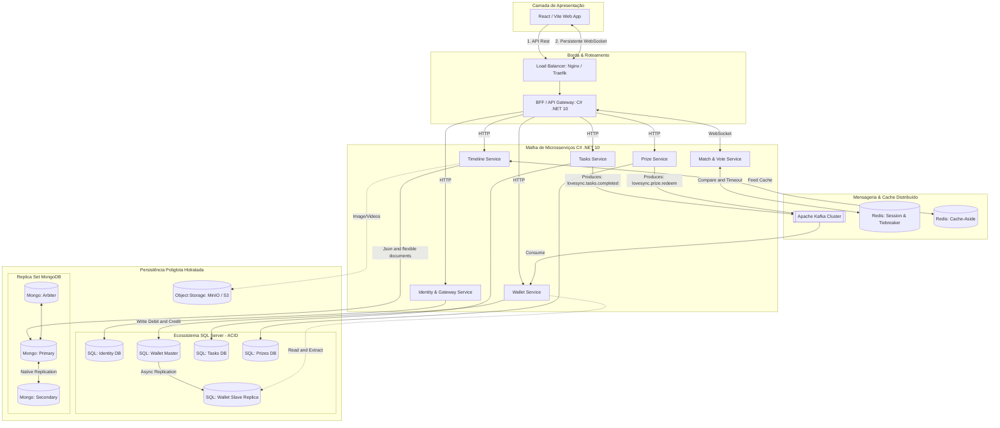
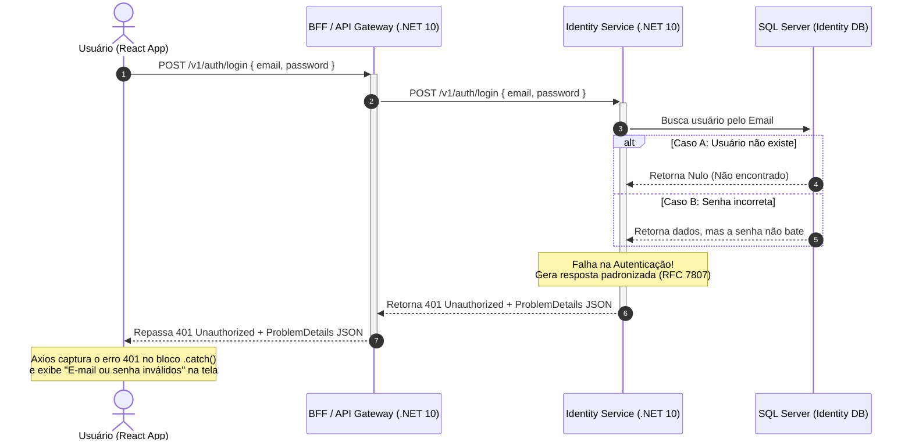

# Couble Hub

## Arquitetura

  ### Matriz de Design Arquitetural dos Microsserviços (.NET 10)

| Microsserviço | Camada de Exposição (Borda) | Arquitetura Interna (Pattern) | Acesso a Dados (Persistência / Cache) | Justificativa de System Design |
| :--- | :--- | :--- | :--- | :--- |
| **BFF / Gateway** | Minimal APIs | **Proxy / Aggregator Pattern** | Sem banco de dados próprio | Centraliza a segurança (validação de JWT), simplifica a comunicação do React eliminando o CORS múltiplo e faz agregação de dados em paralelo para otimizar as requisições da UI. |
| **Identity Service** | Minimal APIs | **Vertical Slices** | EF Core direto no DbContext (SQL Server - Identity DB) | Domínio relacional estável e focado em operações transacionais de cadastro (CRUD), login e geração de tokens, sem complexidade que justifique CQRS. |
| **Tasks Service** | Minimal APIs | **Vertical Slices** | EF Core direto no DbContext (SQL Server - Tasks DB) | Gerencia o ciclo de vida e aprovação das tarefas. As fatias verticais isolam o código de cada funcionalidade (ex: Criar Tarefa, Concluir Tarefa), facilitando a manutenção. |
| **Prize Service** | Minimal APIs | **Vertical Slices** | EF Core direto no DbContext (SQL Server) + **Redis (Redlock)** | Controla a loja de recompensas. O uso do algoritmo Redlock impede *race conditions* perigosas (ex: múltiplos cliques simulando resgates concorrentes do mesmo prêmio). |
| **Match & Vote Service** | Minimal APIs + **SignalR Hubs** | **Vertical Slices (Event-Driven In-Memory)** | **StackExchange.Redis** (Hashes com TTL) \| *Sem banco relacional* | Operação pura em tempo real para a roleta do casal. O SignalR gerencia conexões persistentes WebSockets e o Redis armazena os votos voláteis com expiração automática por TTL. |
| **Wallet Service** | Minimal APIs | **CQRS (com MediatR)** | **EF Core** (Escrita no Master) / **Dapper** (Leitura na Réplica Slave) | Livro-caixa financeiro crítico. Separa comandos complexos de alteração de saldo (Master ACID) de consultas pesadas de extrato histórico de tokens executadas na Réplica de Leitura. |
| **Timeline Service** | Minimal APIs | **CQRS (com MediatR)** | **MongoDB Driver** (Replica Set) + **Redis** (Estratégia Cache-Aside) | O microsserviço mais lido do sistema. Utiliza persistência de documentos JSON flexíveis e um cache de alta performance para entregar o feed em poucos milissegundos sem onerar a base. |

## Features

### Successfull auth

### Unsuccessfull auth

### Registration 
'''mermaid
sequenceDiagram
    autonumber
    actor Usuario as Usuário (Tela)
    participant Front as Front-end (React)
    participant BFF as BFF (Orquestrador)
    participant Identity as Identity Service

    Usuario->>Front: Preenche dados e clica em "Cadastrar"
    Front->>BFF: POST /api/auth/register (Uma única requisição)
    
    Note over BFF, Identity: Passo 1: Criação da Conta
    BFF->>Identity: POST /auth/signup (ou endpoint de registo)
    Note over Identity: Cria o utilizador no Banco de Dados.
    Identity-->>BFF: HTTP 201 Created (Utilizador criado)
    
    Note over BFF, Identity: Passo 2: Autenticação Imediata
    BFF->>Identity: POST /auth/login (Chama o login com as mesmas credenciais)
    Note over Identity: Valida as credenciais e gera o JWT.
    Identity-->>BFF: HTTP 200 OK (Retorna o Token JWT)
    
    Note over BFF, Front: Passo 3: Envio dos dados consolidados
    BFF-->>Front: HTTP 201 (Payload: { token, user })
    
    Front->>Front: useAuth.login(token, user)  (Salva o token localmente)
    Front->>Usuario: Redireciona direto para a Home
'''